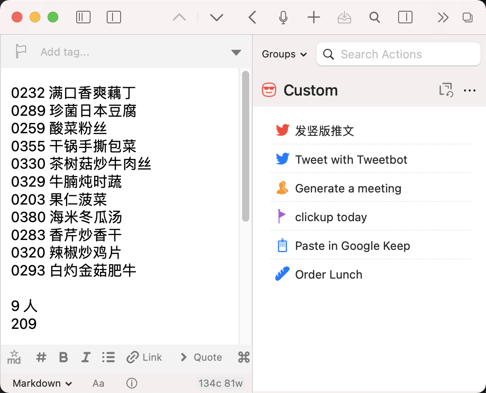

<!-- PROJECT SHIELDS -->
<!--
*** I'm using markdown "reference style" links for readability.
*** Reference links are enclosed in brackets [ ] instead of parentheses ( ).
*** See the bottom of this document for the declaration of the reference variables
*** for contributors-url, forks-url, etc. This is an optional, concise syntax you may use.
*** https://www.markdownguide.org/basic-syntax/#reference-style-links
-->

[![Contributors][contributors-shield]][contributors-url]
[![Forks][forks-shield]][forks-url]
[![Stargazers][stars-shield]][stars-url]
[![Issues][issues-shield]][issues-url]
[![MIT License][license-shield]][license-url]

<!-- PROJECT LOGO -->
<br />
<p align="center">
  <a href="https://github.com/kchen0x/donglaishun-order">
    
  </a>

  <h3 align="center">Donglaishun Order</h3>

  <p align="center">
    A bot script to order dishes for Donglaishun in Drafts.
    <br />
    <a href="https://github.com/kchen0x/donglaishun-order"><strong>Explore the docs »</strong></a>
    <br />
    <br />
    <a href="https://github.com/kchen0x/donglaishun-order">View Demo</a>
    ·
    <a href="https://github.com/kchen0x/donglaishun-order/issues">Report Bug</a>
    ·
    <a href="https://github.com/kchen0x/donglaishun-order/issues">Request Feature</a>
  </p>
</p>


<!-- TABLE OF CONTENTS -->
<details open="open">
  <summary><h2 style="display: inline-block">Table of Contents</h2></summary>
  <ol>
    <li>
      <a href="#about-the-project">About The Project</a>
      <ul>
        <li><a href="#built-with">Built With</a></li>
      </ul>
    </li>
    <li>
      <a href="#getting-started">Getting Started</a>
      <ul>
        <li><a href="#prerequisites">Prerequisites</a></li>
        <li><a href="#installation">Installation</a></li>
      </ul>
    </li>
    <li><a href="#usage">Usage</a></li>
    <li><a href="#roadmap">Roadmap</a></li>
    <li><a href="#contributing">Contributing</a></li>
    <li><a href="#license">License</a></li>
    <li><a href="#contact">Contact</a></li>
    <li><a href="#acknowledgements">Acknowledgements</a></li>
  </ol>
</details>


<!-- ABOUT THE PROJECT -->
## About The Project




### Built With

* [VS Code](https://code.visualstudio.com)
* [NodeJS](https://nodejs.org)
* [Drafts](https://getdrafts.com)


<!-- GETTING STARTED -->
## Getting Started

To get a local copy up and running follow these simple steps.

### Prerequisites

This is an example of how to list things you need to use the software and how to install them.
* npm
  ```sh
  npm install npm@latest -g
  ```

### Installation

* Clone the repo
   ```sh
   git clone https://github.com/kchen0x/donglaishun-order.git
   ```

### Test

* with NodeJS
  ```sh
  node test.js
  ```
<!-- ROADMAP -->
## Roadmap

See the [open issues](https://github.com/kchen0x/donglaishun-order/issues) for a list of proposed features (and known issues).


<!-- CONTRIBUTING -->
## Contributing

Contributions are what make the open source community such an amazing place to be learn, inspire, and create. Any contributions you make are **greatly appreciated**.

1. Fork the Project
2. Create your Feature Branch (`git checkout -b feature/AmazingFeature`)
3. Commit your Changes (`git commit -m 'Add some AmazingFeature'`)
4. Push to the Branch (`git push origin feature/AmazingFeature`)
5. Open a Pull Request


<!-- LICENSE -->
## License

Distributed under the MIT License. See `LICENSE` for more information.

<!-- CONTACT -->
## Contact

Kun Chen - [@kchen0x](https://twitter.com/kchen0x) - kchen0x@gmail.com

Project Link: [https://github.com/kchen0x/donglaishun-order](https://github.com/kchen0x/donglaishun-order)

<!-- MARKDOWN LINKS & IMAGES -->
<!-- https://www.markdownguide.org/basic-syntax/#reference-style-links -->
[contributors-shield]: https://img.shields.io/github/contributors/kchen0x/donglaishun-order.svg?style=for-the-badge
[contributors-url]: https://github.com/kchen0x/donglaishun-order/graphs/contributors
[forks-shield]: https://img.shields.io/github/forks/kchen0x/donglaishun-order.svg?style=for-the-badge
[forks-url]: https://github.com/kchen0x/donglaishun-order/network/members
[stars-shield]: https://img.shields.io/github/stars/kchen0x/donglaishun-order.svg?style=for-the-badge
[stars-url]: https://github.com/kchen0x/donglaishun-order/stargazers
[issues-shield]: https://img.shields.io/github/issues/kchen0x/donglaishun-order.svg?style=for-the-badge
[issues-url]: https://github.com/kchen0x/donglaishun-order/issues
[license-shield]: https://img.shields.io/github/license/kchen0x/donglaishun-order.svg?style=for-the-badge
[license-url]: https://github.com/kchen0x/donglaishun-order/blob/master/LICENSE.txt